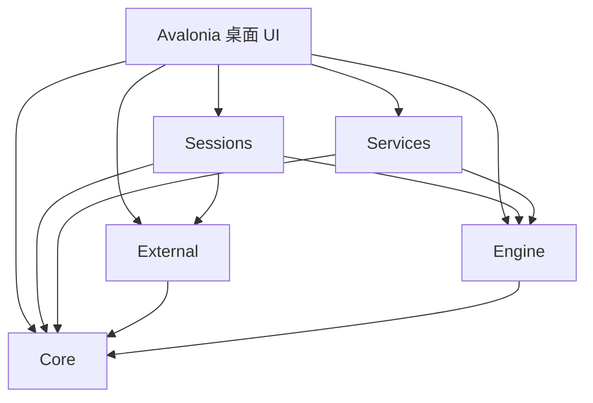
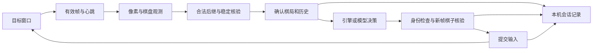

# 工程架构

## 识别运行时

`External` 只依赖 ONNX Runtime 的托管接口；平台原生运行库由应用项目按发布 RID 选择。Windows 使用固定版本 Windows ML C API / DirectML，macOS / Linux 使用匹配的 ONNX Runtime 包，避免同包出现两套 `onnxruntime.dll`。

`InferenceModel` 管理每个模型的 CPU 就绪会话、后台加速预热、请求间原子切换与故障回退。`OrtRecognitionSession` 管理输入形状、OCR 单字／批量会话、取消与预热剖析文件生命周期。`InferenceDevices` 和 `WindowsMlCatalog` 负责硬件发现；识别器本身不依赖 Avalonia，也不识别特定皮肤。前端仅低频读取 `RecognitionAcceleration` 状态。

[文档目录](README.md) · [构建与测试](development.md)

## 解决方案与依赖

入口为 [`PaddiChess.slnx`](../PaddiChess.slnx)。项目使用 C# 命名空间 `PaddiXiangqi`，桌面应用和程序集采用“Paddi象棋”名称。棋谱格式标识为 `PaddiXiangqi/1`，旧数据目录名仅用于兼容迁移。

| 路径 | 责任 | 边界 |
| --- | --- | --- |
| `PaddiChess/Core` | 棋局、基本合法走法、FEN、棋谱、历史 | 无其他业务层与 Avalonia 依赖 |
| `PaddiChess/Engine` | UCI 进程、能力协商、规则客户端、模型 API、搜索预算 | 仅依赖 Core，不读取控件 |
| `PaddiChess/External` | 捕获、输入、像素、定位、样式、棋子分类、OCR、合法后继 | 依赖 Core、SkiaSharp、ONNX Runtime，不引用 Avalonia |
| `PaddiChess/Services` | 偏好、异步保存、棋谱存储、接管历史、声音 | 依赖 Core / Engine，不创建视图 |
| `PaddiChess/Sessions` | 同步状态机、后台识别、输入核验和控制方决策 | 依赖 Core / Engine / External，不持有控件 |
| `PaddiChess/Views` | AXAML、页面事件、窗口生命周期和交互调度 | 承接 UI，调用业务服务 |
| `PaddiChess/ViewModels` | 棋谱、候选、模型目录、规则表单等展示模型 | 不创建视觉控件 |
| `PaddiChess/Controls` | 自绘棋盘、曲线、标定和交互 | 将大量图形合并绘制，避免逐元素布局 |
| `PaddiChess/Native` | Swift 平台桥接、C++ 规则适配器及源码 | 独立进程协议，不嵌入 UI 状态 |

桌面 `.csproj` 用 `Compile Remove` 排除已拆出的业务目录，再通过项目引用连接，避免重复编译。架构测试验证五个业务程序集不引用 Avalonia，并限制 Core 的依赖方向。

`MainWindow` 已拆分多个 partial 文件，但仍承担部分选手切换、交互和生命周期调度。拆 partial 不等于完整 MVVM 迁移；新的可复用业务状态优先放入 Core、Sessions 或独立 ViewModel。

## 关键入口

| 文件／类型 | 用途 |
| --- | --- |
| `Program.cs`、`App.axaml.cs` | 桌面初始化与窗口生命周期 |
| `Core/XiangqiGame.cs` | 活动棋局、历史导航、FEN 与基本合法性 |
| `Engine/PikafishClient.cs` | 常驻 UCI 进程、搜索、取消与握手 |
| `Engine/PikafishRulesClient.cs` | 原生历史规则协议 |
| `Engine/LlmChessClient.cs` | 模型请求、流式解析、参数兼容和响应校验 |
| `Sessions/ControllerDecisionService.cs` | 统一控制方决策与候选校验 |
| `Sessions/ExternalSynchronizationSession.cs` | 稳定候选、遗漏恢复、纠错和终局确认 |
| `Sessions/ExternalInputVerification.cs` | 发送前独立棋子身份核验 |
| `Sessions/ExternalRecognitionRefresh.cs` | 后台完整识别与请求身份 |
| `External/ExternalDesktop.cs` | 平台接口与 macOS／Windows 后端 |
| `External/ExternalPositionRecognizer.cs` | 象棋专用模型与局部 OCR 补识入口 |
| `External/ExternalMoveConfirmation.cs` | 稳定落点确认 |
| `External/ExternalMoveRecovery.cs` | 近期错误匹配的恢复检查点 |
| `Services/ExternalHistoryStore.cs` | 有界串行日志、原子棋谱快照与历史读取 |
| `Views/MainWindow.ExternalHistory.cs` | 会话记录与 UI 生命周期连接 |
| `Views/ExternalHistoryWindow.axaml` | 会话／事件列表、日志和只读事件棋盘 |

上述未带前缀的应用路径均位于 `PaddiChess/` 下。

## 接管数据流

连接即可观察和预计算；开始只授权发送。输入任务未完成时继续采样，以识别目标已落子、对方快速应手以及部分输入结果。UI 提交确认后的棋局，再观察下一帧，避免后台读局面与用户编辑并发。

决策携带当前 FEN、起始 FEN、完整历史与配置身份。一个结果即使着法本身合法，只要请求身份过期，也不能继续发送。取消的模型、引擎和目录响应不能覆盖新局面或新配置。

## 必须保持的状态不变量

1. **棋子与轮次分开取证。** 图像识别结果中的 side-to-move 可能是调用参数；采用完整棋子布局不自动等于确认轮次。
2. **基准帧对应已确认棋局。** 提交一手或快速相邻两手时，棋谱、轮次与视觉基准一起完成更新。
3. **中间落点不是最终落点。** 稳定性、合法续着和身份识别共同约束移动动画。
4. **输入提交不等于成功。** 已开始的部分输入保留待确认状态；取消不能使其自动重发。
5. **恢复不覆盖证据。** 同局校正保留前后事件；替换成新局面前排空旧会话并保存恢复棋谱。
6. **终局需要独立确认。** 搜索预测、候选为空或临时识别失败不能单独结束外部对局。

相关回归包含真实棋盘夹具、合成动画、快速双方着法、同 FEN 不同历史、未知轮次、输入拦截与生命周期路径。

## 并发、取消与资源所有权

UI 控件在 UI 线程访问；识别计算、文件 I/O 和独立引擎／网络请求按职责异步执行。不能以另开一个线程读取不断变化的 `_game` 代替明确的快照和串行提交。

引擎进程、NNUE 和 Hash 可在同一局暂停／继续时复用；断开和终局清理相应资源。本地闲置分析的较大 Hash 需要释放，避免与接管引擎叠加造成内存换页。

窗口关闭先设置关闭状态并取消任务，等待会话、设置写入、历史排空、引擎与捕获资源清理，再真正退出。异步 UI 入口需要考虑重复点击、关闭期间返回以及旧请求晚到。

## 持久化

`PreferencesWriter` 合并短时间内的设置更新，以临时文件和原子替换保存。`GameRecordStorage.ReadValidatedAsync` 在修改活动棋局前完整验证棋谱，避免非法文件只加载一半。

`ExternalHistoryStore` 每会话独立目录，用容量有界的单写入队列保持顺序；候选／输入状态只记小事件，关键节点才保存完整棋谱。写入快照在入队前冻结，后续注释或校正不会改变排队中的旧值。

结束会话先同步摘除旧 writer，再异步排空；重复结束共享排空任务，避免旧回调清掉新会话。读取棋谱的句柄允许原子替换，兼顾 Windows 文件共享规则。日志最后一行因崩溃不完整时，前面的有效事件仍可读取。

UI 预览始终创建独立棋局，棋盘禁止输入并关闭动画。图像识别预览不将 FEN 轮次当作可靠外部轮次；异步会话读取、刷新和复盘使用版本检查，避免旧读取覆盖新选择。

## 原生与平台边界

macOS 桥接由 Swift 编译，通过进程协议实现捕获、权限检测和输入。macOS 14 及以上采用常驻捕获流；较早版本有兼容路径。Windows 后端处理 GDI、像素与平台输入。Linux 未实现外部接管后端。

`Native/PikafishRules` 固定使用 0906 规则源码，发布包的执棋引擎则为 0925；两者职责与规则配置不可混同。适配器不加载 NNUE、不执行棋力搜索，详见[组件来源](../PaddiChess/Native/PikafishRules/SOURCE.md)。

## 后续改进方向

- 继续将可复用调度状态从窗口迁入会话服务，同时保留现有乱序与取消回归。
- 验收 Windows PowerShell 原生构建入口及真实目标窗口，再扩大 CI 覆盖。
- 扩充有授权的主题、字体、光效和 DPI 夹具；无法区分的图像应保持不确定。
- 分别测量捕获、识别、确认、搜索与输入耗时；不通过降低安全核验门槛获得好看的延迟。
- 若未来让模型裁判跟随任意插件规则，需要可验证协议；不能假定标准 UCI 已提供统一的历史禁手接口。
